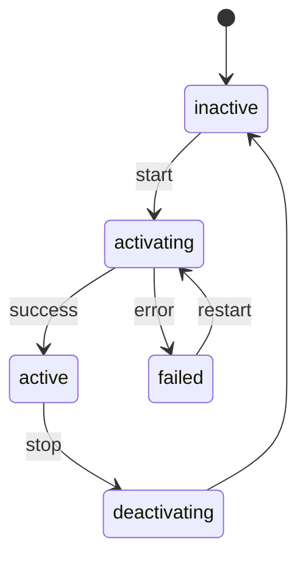

<a id="top"></a>

<div align="center">

# 🐧 Linux Command Cheat Sheet

**A comprehensive reference for terminal commands — with examples, explanations, and deep dives**


</div>

> **💡 How to use this cheat sheet:**
> Each table shows the most important commands at a glance. Under `📚 More Examples & Explanations` (collapsible), you will find in-depth examples and sample outputs. At the very bottom, there are bonus references (chmod calculator, kill signals, one-liners, troubleshooting) as well as an interactive learning checklist.

---

## 📑 Table of Contents

**Basics**
- [01 · 🧭 Navigation & File System](#navigation)
- [02 · 📁 Managing Files & Directories](#files)
- [03 · 📝 Viewing & Editing File Contents](#content)
- [04 · 🔐 Permissions & Ownership](#permissions)

**System & Processes**
- [05 · ⚙️ Processes & System Monitoring](#processes)
- [06 · 📦 Package Management](#packages)
- [07 · 🖥️ System Information](#systeminfo)
- [08 · 🛠️ Systemd & Services](#systemd)
- [09 · ⏰ Cron & Scheduled Tasks](#cron)

**Network & Data**
- [10 · 🌐 Network & Remote Access](#network)
- [11 · 🗜️ Archiving & Compression](#archives)
- [12 · 🔍 Text Processing & Search](#text)
- [13 · 💾 Disks & Storage Management](#storage)

**Shell & Environment**
- [14 · 👤 User & Group Management](#users)
- [15 · 🌱 Environment Variables & Shell](#environment)
- [16 · 🔀 I/O Redirection & Pipes](#redirection)
- [17 · ⌨️ Important Keyboard Shortcuts](#shortcuts)

**Bonus References**
- [18 · 🔢 chmod Reference (Octal Calculator)](#chmod-reference)
- [19 · 🚦 Kill Signals](#signals)
- [20 · 💡 Useful One-Liners](#oneliners)
- [21 · 🧯 Troubleshooting Cheat Sheet](#troubleshooting)
- [22 · ✅ Interactive Learning Checklist](#checklist)
- [23 · ❓ FAQ](#faq)

---

<a id="navigation"></a>

## 01 · 🧭 Navigation & File System

Move around the file system and view directory contents.

| Command | Description | Example |
|---|---|---|
| `pwd` | Print current working directory | `pwd` |
| `ls` | List directory contents | `ls -la` |
| `cd` | Change directory | `cd /var/log` |
| `cd ..` | Move up one level | `cd ..` |
| `cd ~` | Go to home directory | `cd ~` |
| `cd -` | Jump back to previous directory | `cd -` |
| `tree` | Show directory tree graphically | `tree -L 2` |
| `find` | Search for files/directories | `find / -name "*.log"` |
| `locate` | Fast file search via database | `locate nginx.conf` |
| `which` | Show path of a command | `which python3` |
| `whereis` | Find binary, source & man page | `whereis bash` |
| `realpath` | Show absolute path of a file | `realpath ./script.sh` |
| `pushd` / `popd` | Push directory to stack / pop back | `pushd /tmp` |

<details>
<summary>📚 More Examples & Explanations for Navigation</summary>

**`ls` — The most important flags**

```bash
ls -l     # Long format showing permissions, size, date
ls -a     # Show hidden files (starting with .)
ls -la    # Combination of both
ls -lh    # Human-readable sizes (KB/MB/GB instead of bytes)
ls -lt    # Sort by modification date (newest first)
ls -lS    # Sort by file size (largest first)
```

Example output of `ls -lh`:

```
drwxr-xr-x  3 user user 4.0K Jul 20 09:12 project
-rw-r--r--  1 user user  128 Jul 19 22:04 notes.txt
-rwxr-xr-x  1 user user 2.1K Jul 18 14:33 backup.sh
```

**`find` — Targeted search**

```bash
find . -name "*.js"                 # All .js files in current directory (recursive)
find /home -user alex               # All files owned by "alex"
find . -mtime -7                    # Files modified in the last 7 days
find . -size +100M                  # Files larger than 100 MB
find . -type d -empty               # Find empty directories
find . -name "*.tmp" -delete        # Delete found files immediately (Caution!)
```

> **⚠️ Warning:** `-delete` removes files immediately and irreversibly. Always test without `-delete` first to ensure the match list is correct.

</details>

[⬆️ Back to top](#top)

---

<a id="files"></a>

## 02 · 📁 Managing Files & Directories

Create, copy, move, and delete files and folders.

| Command | Description | Example |
|---|---|---|
| `mkdir` | Create new directory | `mkdir -p project/src` |
| `rmdir` | Remove empty directory | `rmdir old_folder` |
| `touch` | Create empty file / update timestamp | `touch file.txt` |
| `cp` | Copy files/directories | `cp -r source/ target/` |
| `mv` | Move or rename | `mv old.txt new.txt` |
| `rm` | Delete file | `rm file.txt` |
| `rm -rf` | Delete directory incl. contents (Caution!) | `rm -rf folder/` |
| `ln -s` | Create symbolic link | `ln -s /path/target link` |
| `ln` | Create hard link | `ln original.txt hard.txt` |
| `stat` | Display detailed file information | `stat file.txt` |
| `file` | Determine file type | `file image.png` |
| `mktemp` | Create temporary file/directory | `mktemp -d` |

<details>
<summary>📚 More Examples & Explanations for File Operations</summary>

**Symbolic link vs. Hard link**

```bash
ln -s /path/original.txt link.txt   # Symlink: Reference to the path (can cross filesystems)
ln /path/original.txt hard.txt      # Hardlink: Points to the same inode (same filesystem only)
```

A symlink is like a shortcut (breaks if the target is deleted), whereas a hardlink is a second name for the exact same data on the disk.

**Safe deletion**

```bash
rm -i file.txt           # Prompts before each deletion
alias rm='rm -i'         # Handy: make rm interactive by default (in ~/.bashrc)
```

**`cp` with progress & backup**

```bash
cp -v source.txt target.txt      # -v = verbose, shows what is being copied
cp -u source.txt target.txt      # -u = only copy if newer/missing (update)
cp --backup=numbered a.txt b.txt # Creates numbered backups instead of overwriting
```

</details>

[⬆️ Back to top](#top)

---

<a id="content"></a>

## 03 · 📝 Viewing & Editing File Contents

Read, scroll through, and edit text files in the terminal.

| Command | Description | Example |
|---|---|---|
| `cat` | Output entire file content | `cat file.txt` |
| `cat -n` | Output with line numbers | `cat -n script.sh` |
| `less` | Scroll through file page by page | `less file.log` |
| `head` | Show first lines of a file | `head -n 20 file.log` |
| `tail` | Show last lines of a file | `tail -n 20 file.log` |
| `tail -f` | Follow file content live | `tail -f /var/log/syslog` |
| `nano` | Simple terminal text editor | `nano file.txt` |
| `vim` | Advanced terminal text editor | `vim file.txt` |
| `diff` | Compare two files | `diff a.txt b.txt` |
| `diff -u` | Compare in unified patch format | `diff -u old.txt new.txt` |
| `wc` | Count lines, words, characters | `wc -l file.txt` |
| `comm` | Compare two sorted files line by line | `comm a.txt b.txt` |

<details>
<summary>📚 More Examples & Explanations for File Contents</summary>

**`less` — The most important keys**

| Key | Action |
|---|---|
| `Space` | Page forward |
| `b` | Page backward |
| `/word` | Search forward for "word" |
| `n` | Jump to the next search result |
| `g` / `G` | Jump to the beginning / end of the file |
| `q` | Quit `less` |

**Watch multiple logs live simultaneously**

```bash
tail -f /var/log/nginx/access.log /var/log/nginx/error.log
```

**Understanding `diff -u` output** (Patch format, `-` = removed, `+` = added):

```diff
--- old.txt
+++ new.txt
@@ -1,3 +1,3 @@
 Line one
-Line two (old)
+Line two (new)
 Line three
```

</details>

[⬆️ Back to top](#top)

---

<a id="permissions"></a>

## 04 · 🔐 Permissions & Ownership

Control access rights and ownership of files.

| Command | Description | Example |
|---|---|---|
| `chmod` | Change access permissions (numeric) | `chmod 755 script.sh` |
| `chmod +x` | Make file executable (symbolic) | `chmod +x script.sh` |
| `chmod -R` | Change permissions recursively for folder | `chmod -R 644 folder/` |
| `chown` | Change owner | `chown user:group file.txt` |
| `chown -R` | Change owner recursively | `chown -R www-data:www-data /var/www` |
| `chgrp` | Change group | `chgrp developers file.txt` |
| `umask` | Show/set default permission mask | `umask 022` |
| `getfacl` | Show extended ACL permissions | `getfacl file.txt` |
| `setfacl` | Set extended ACL permissions | `setfacl -m u:alex:rwx file` |

<details>
<summary>📚 More Examples & Explanations for Permissions</summary>

**Numeric vs. Symbolic**

```bash
chmod 644 file.txt       # Owner: rw-, Group: r--, Others: r--
chmod u+x script.sh      # Add execute permission for the Owner only
chmod g-w file.txt       # Remove write permission for the Group
chmod o=r file.txt       # Set "Others" exactly to read-only
chmod a+r file.txt       # Give read access to All (owner, group, others)
```

You can find a complete octal reference table under [18 · chmod Reference](#chmod-reference).

**Typical error: "Permission denied" during script execution**

```bash
./script.sh
# bash: ./script.sh: Permission denied
chmod +x script.sh   # Set execute permission
./script.sh          # Now it works
```

</details>

[⬆️ Back to top](#top)

---

<a id="processes"></a>

## 05 · ⚙️ Processes & System Monitoring

Monitor, prioritize, and terminate running processes.

| Command | Description | Example |
|---|---|---|
| `ps aux` | Show running processes (BSD style) | `ps aux` |
| `ps -ef` | Show running processes (UNIX style) | `ps -ef` |
| `top` | Monitor processes live | `top` |
| `htop` | Interactive process overview (advanced) | `htop` |
| `kill` | Terminate process by PID | `kill 1234` |
| `kill -9` | Forcefully terminate process | `kill -9 1234` |
| `kill -l` | List all available signals | `kill -l` |
| `killall` | Terminate processes by name | `killall firefox` |
| `pkill` | Terminate processes by pattern | `pkill -f node` |
| `jobs` | Show background jobs of the shell | `jobs` |
| `bg` / `fg` | Move job to background/foreground | `fg %1` |
| `nice` | Start process with specific priority | `nice -n 10 script.sh` |
| `renice` | Change priority of running processes | `renice 5 -p 1234` |
| `nohup` | Detach process from terminal | `nohup ./server.sh &` |
| `disown` | Remove job from shell's job table | `disown %1` |

<details>
<summary>📚 More Examples & Explanations for Processes</summary>

**Find and kill process by name**

```bash
ps aux | grep node          # List all Node processes
pkill -f "node server.js"   # Terminate process based on command line
```

**Foreground/Background Workflow**

```bash
./long_task.sh          # Runs in foreground
# Press Ctrl+Z -> Process is paused
bg                      # Continue running in background
jobs                    # Shows: [1]+ Running  ./long_task.sh &
fg %1                   # Bring back to foreground
```

**Keep process running permanently in background (survives terminal close)**

```bash
nohup ./server.sh > log.txt 2>&1 &
disown
```

</details>

[⬆️ Back to top](#top)

---

<a id="packages"></a>

## 06 · 📦 Package Management

Install, update, and remove software (distribution-dependent).

| Command | Description | Example |
|---|---|---|
| `apt update && apt upgrade` | Debian/Ubuntu: Update package lists & system | `sudo apt update && sudo apt upgrade` |
| `apt install` | Debian/Ubuntu: Install package | `sudo apt install git` |
| `apt remove` | Debian/Ubuntu: Remove package | `sudo apt remove git` |
| `apt search` | Debian/Ubuntu: Search for package | `apt search nginx` |
| `dpkg -i` | Debian: Install `.deb` package manually | `sudo dpkg -i package.deb` |
| `dnf` / `yum` | Fedora/RHEL: Install package | `sudo dnf install git` |
| `pacman -S` | Arch Linux: Install package | `sudo pacman -S git` |
| `pacman -Syu` | Arch Linux: Update entire system | `sudo pacman -Syu` |
| `snap install` | Install universal Snap package | `sudo snap install code` |
| `flatpak install` | Install universal Flatpak package | `flatpak install flathub org.gimp.GIMP` |

<details>
<summary>📚 More Examples & Explanations for Package Management</summary>

**Clean up system (remove unnecessary packages)**

```bash
sudo apt autoremove && sudo apt clean     # Debian/Ubuntu
sudo dnf autoremove && sudo dnf clean all # Fedora/RHEL
sudo pacman -Sc                           # Arch Linux
```

**List installed packages**

```bash
dpkg -l | less         # Debian/Ubuntu
dnf list installed     # Fedora/RHEL
pacman -Q              # Arch Linux
```

</details>

[⬆️ Back to top](#top)

---

<a id="systeminfo"></a>

## 07 · 🖥️ System Information

View hardware, utilization, and system status.

| Command | Description | Example |
|---|---|---|
| `uname -a` | Show kernel & system information | `uname -a` |
| `cat /etc/os-release` | Show distribution & version | `cat /etc/os-release` |
| `uptime` | Show system uptime & load average | `uptime` |
| `free -h` | Show RAM usage | `free -h` |
| `lscpu` | Show CPU information | `lscpu` |
| `nproc` | Number of available CPU cores | `nproc` |
| `lsusb` | List USB devices | `lsusb` |
| `lspci` | List PCI devices | `lspci` |
| `hostnamectl` | Show hostname & OS details | `hostnamectl` |
| `dmesg` | Kernel ring buffer / hardware messages | `dmesg \| tail -20` |
| `vmstat` | System load (CPU, memory, I/O) | `vmstat 2 5` |

<details>
<summary>📚 More Examples & Explanations for System Information</summary>

**Understanding `free -h` output**

```
              total        used        free      shared  buff/cache   available
Mem:           15Gi       4.2Gi       6.1Gi       412Mi       5.0Gi        10Gi
Swap:         2.0Gi          0B       2.0Gi
```

`available` is the realistic number — it takes into account that cache can be freed up if needed.

**View latest hardware/kernel errors**

```bash
dmesg | tail -30
dmesg | grep -i error
```

</details>

[⬆️ Back to top](#top)

---

<a id="systemd"></a>

## 08 · 🛠️ Systemd & Services

Manage background services and view logs.

| Command | Description | Example |
|---|---|---|
| `systemctl status` | Show status of a service | `systemctl status nginx` |
| `systemctl start` / `stop` | Start/stop service | `sudo systemctl start nginx` |
| `systemctl restart` | Restart service | `sudo systemctl restart nginx` |
| `systemctl reload` | Reload configuration (without restart) | `sudo systemctl reload nginx` |
| `systemctl enable` / `disable` | (De)activate service on boot | `sudo systemctl enable nginx` |
| `systemctl is-enabled` | Check if autostart is active | `systemctl is-enabled nginx` |
| `systemctl list-units` | List all active units | `systemctl list-units --type=service` |
| `journalctl -u` | View logs for a specific service | `journalctl -u nginx` |
| `journalctl -f` | Follow logs live | `journalctl -f` |
| `journalctl --since` | Show logs from a specific time | `journalctl --since "1 hour ago"` |

<details>
<summary>📚 More Examples & Explanations for Systemd</summary>

**Lifecycle of a service**



**Why won't my service start?**

```bash
systemctl status myservice.service   # Quick overview + last lines
journalctl -u myservice.service -xe  # Detailed error information
```

</details>

[⬆️ Back to top](#top)

---

<a id="cron"></a>

## 09 · ⏰ Cron & Scheduled Tasks

Run commands automatically at specific times.

| Command | Description | Example |
|---|---|---|
| `crontab -e` | Edit cron jobs | `crontab -e` |
| `crontab -l` | List current cron jobs | `crontab -l` |
| `crontab -r` | Remove all user cron jobs | `crontab -r` |
| `at` | Run one-time command at a later time | `at 22:00 -f script.sh` |

<details>
<summary>📚 More Examples & Explanations for Cron</summary>

**The 5 time fields of Cron**

```
┌───────────── Minute        (0 - 59)
│ ┌───────────── Hour        (0 - 23)
│ │ ┌───────────── Day of month (1 - 31)
│ │ │ ┌───────────── Month   (1 - 12)
│ │ │ │ ┌───────────── Day of week (0 - 6, Sun=0)
│ │ │ │ │
* * * * *  Command
```

**Example Schedules**

| Expression | Meaning |
|---|---|
| `*/5 * * * *` | Every 5 minutes |
| `0 3 * * *` | Daily at 3:00 AM |
| `0 0 * * 0` | Every Sunday at midnight |
| `0 9-17 * * 1-5` | Hourly between 9 AM - 5 PM, Mon-Fri |
| `0 0 1 * *` | On the 1st of every month at midnight |

```bash
# Example entry: daily backup at 3 AM
0 3 * * * /home/user/backup.sh >> /home/user/backup.log 2>&1
```

</details>

[⬆️ Back to top](#top)

---

<a id="network"></a>

## 10 · 🌐 Network & Remote Access

Check connections, transfer data, and view network configuration.

| Command | Description | Example |
|---|---|---|
| `ip a` | Show network interfaces & IP addresses | `ip a` |
| `ip route` | Show routing table | `ip route` |
| `ifconfig` | Show network interfaces (older) | `ifconfig` |
| `ping` | Test reachability of a host | `ping example.com` |
| `curl` | Send HTTP requests / download files | `curl -O https://example.com/file` |
| `wget` | Download files from the web | `wget https://example.com/file.zip` |
| `ss` | Show network connections/ports | `ss -tulpn` |
| `netstat` | Show network connections (older) | `netstat -tulpn` |
| `ssh` | Secure connection to remote host | `ssh user@server.com` |
| `scp` | Copy files securely over SSH | `scp file.txt user@host:/path` |
| `rsync` | Synchronize files efficiently | `rsync -avz src/ user@host:/target/` |
| `dig` / `nslookup` | Check DNS resolution | `dig example.com` |
| `traceroute` | Show network path to a host | `traceroute example.com` |
| `nc` (netcat) | Test raw TCP/UDP connections | `nc -zv example.com 443` |

<details>
<summary>📚 More Examples & Explanations for Network</summary>

**`curl` — Common use cases**

```bash
curl -I [https://example.com](https://example.com)                  # Fetch HTTP headers only
curl -O [https://example.com/file.zip](https://example.com/file.zip)         # Save file with original name
curl -X POST -H "Content-Type: application/json" \
     -d '{"name":"Alex"}' [https://api.example.com/users](https://api.example.com/users)
```

**SSH Port Forwarding (Local → Remote)**

```bash
ssh -L 8080:localhost:80 user@server.com
# Opens local port 8080, which is forwarded to port 80 on the server
```

**SSH Configuration for frequent hosts (`~/.ssh/config`)**

```
Host myserver
    HostName 192.168.1.100
    User user
    Port 22
    IdentityFile ~/.ssh/id_ed25519
```

Afterward, this is enough: `ssh myserver`

</details>

[⬆️ Back to top](#top)

---

<a id="archives"></a>

## 11 · 🗜️ Archiving & Compression

Bundle, compress, and extract files.

| Command | Description | Example |
|---|---|---|
| `tar -cvf` | Create Tar archive | `tar -cvf archive.tar folder/` |
| `tar -xvf` | Extract Tar archive | `tar -xvf archive.tar` |
| `tar -czvf` | Create Gzip-compressed archive | `tar -czvf archive.tar.gz folder/` |
| `tar -xzvf` | Extract Gzip-compressed archive | `tar -xzvf archive.tar.gz` |
| `tar -tvf` | List archive contents (without extracting) | `tar -tvf archive.tar.gz` |
| `zip` | Create ZIP archive | `zip -r archive.zip folder/` |
| `unzip` | Extract ZIP archive | `unzip archive.zip` |
| `gzip` / `gunzip` | Compress/extract single file | `gzip file.txt` |
| `xz` | Strong compression of single files | `xz file.txt` |

<details>
<summary>📚 More Examples & Explanations for Archives</summary>

**Extract a single file from an archive**

```bash
tar -xzvf archive.tar.gz path/in/archive/file.txt
```

**Mnemonic for `tar` flags:** `c`=create, `x`=extract, `t`=list, `v`=verbose, `z`=gzip, `f`=file (must always be the last flag before the filename).

</details>

[⬆️ Back to top](#top)

---

<a id="text"></a>

## 12 · 🔍 Text Processing & Search

Filter, search, and transform text data.

| Command | Description | Example |
|---|---|---|
| `grep` | Search text patterns in files | `grep -r "error" /var/log` |
| `grep -i` | Ignore case sensitivity | `grep -i "error" log.txt` |
| `grep -v` | Exclude matching lines | `grep -v "debug" log.txt` |
| `grep -c` | Count number of matches | `grep -c "404" access.log` |
| `sed` | Search and replace text (stream editor) | `sed 's/old/new/g' file.txt` |
| `sed -i` | Edit file directly (in place) | `sed -i 's/old/new/g' file.txt` |
| `awk` | Column-based text processing | `awk '{print $1}' file.txt` |
| `sort` | Sort lines | `sort -n numbers.txt` |
| `uniq -c` | Count duplicate lines | `sort file.txt \| uniq -c` |
| `cut` | Extract columns from lines | `cut -d',' -f2 data.csv` |
| `tr` | Replace/delete characters | `tr 'a-z' 'A-Z' < file.txt` |
| `xargs` | Pass output as arguments to command | `find . -name "*.tmp" \| xargs rm` |

<details>
<summary>📚 More Examples & Explanations for Text Processing</summary>

**Count words and sort by frequency (classic pipe example)**

```bash
cat text.txt | tr ' ' '\n' | sort | uniq -c | sort -nr | head -10
```

How this pipe chain works:


**`sed` — Search & Replace**

```bash
sed 's/Dog/Cat/' file.txt          # Replaces only the first occurrence per line
sed 's/Dog/Cat/g' file.txt         # Replaces all occurrences (global)
sed -i.bak 's/old/new/g' file.txt  # Modifies file directly, creates .bak backup
```

**`awk` — Processing columns**

```bash
awk '{print $1, $3}' data.txt          # Print columns 1 and 3
awk -F',' '{print $2}' data.csv        # Use comma as delimiter
awk '{sum += $2} END {print sum}' num.txt   # Sum up column 2
```

</details>

[⬆️ Back to top](#top)

---

<a id="storage"></a>

## 13 · 💾 Disks & Storage Management

Manage storage space, drives, and file systems.

| Command | Description | Example |
|---|---|---|
| `df -h` | Show disk space of all file systems | `df -h` |
| `df -i` | Show used/free inodes | `df -i` |
| `du -sh` | Show disk usage of a folder | `du -sh /var/log` |
| `mount` | Mount file system | `mount /dev/sdb1 /mnt/usb` |
| `umount` | Unmount file system | `umount /mnt/usb` |
| `lsblk` | List block devices/partitions | `lsblk` |
| `fdisk -l` | Show partition tables | `sudo fdisk -l` |
| `mkfs` | Create file system on partition | `mkfs.ext4 /dev/sdb1` |
| `blkid` | Show UUIDs & file system types | `blkid` |
| `fsck` | Check file system for errors | `sudo fsck /dev/sdb1` |

<details>
<summary>📚 More Examples & Explanations for Storage</summary>

**Find the 10 largest folders in the current directory**

```bash
du -sh */ 2>/dev/null | sort -rh | head -10
```

**Why is my disk full even though `du` shows little usage?**
Usually, this is due to deleted files that are still open (e.g., by a logging process). Check with:

```bash
lsof +L1
```

</details>

[⬆️ Back to top](#top)

---

<a id="users"></a>

## 14 · 👤 User & Group Management

Manage user accounts, groups, and system-level permissions.

| Command | Description | Example |
|---|---|---|
| `whoami` | Show current user | `whoami` |
| `id` | Show user and group IDs | `id` |
| `useradd -m` | Create new user with home directory | `sudo useradd -m alex` |
| `usermod -aG` | Add user to a group | `sudo usermod -aG sudo alex` |
| `passwd` | Change password | `passwd` |
| `userdel` | Delete user | `sudo userdel -r alex` |
| `groupadd` | Create new group | `sudo groupadd developers` |
| `su` | Switch to another user | `su alex` |
| `sudo` | Execute command with root privileges | `sudo apt update` |
| `sudo -l` | Show own sudo privileges | `sudo -l` |
| `who` / `w` | Show logged-in users | `who` |
| `last` | Show recent logins | `last -5` |

<details>
<summary>📚 More Examples & Explanations for User Management</summary>

**Add user to a group (e.g., use Docker without sudo)**

```bash
sudo usermod -aG docker alex
# Afterwards: log out and back in for the group membership to take effect
```

**`su` vs. `sudo` — briefly explained:** `su` switches completely to another user (usually root) and starts their shell. `sudo` only executes a *single command* with elevated privileges and returns to your own user afterwards — this is the safer, recommended way.

</details>

[⬆️ Back to top](#top)

---

<a id="environment"></a>

## 15 · 🌱 Environment Variables & Shell

Configure shell environment and use history.

| Command | Description | Example |
|---|---|---|
| `export` | Set environment variable | `export PATH=$PATH:/new/path` |
| `echo $VAR` | Show value of a variable | `echo $HOME` |
| `env` / `printenv` | Show all environment variables | `env` |
| `alias` | Define shortcut command | `alias ll='ls -la'` |
| `unalias` | Remove alias | `unalias ll` |
| `history` | Show command history | `history` |
| `source` | Execute script in current shell | `source ~/.bashrc` |
| `set` / `unset` | Set/remove shell variable | `unset MY_VAR` |

<details>
<summary>📚 More Examples & Explanations for Environment Variables</summary>

**The most important predefined variables**

| Variable | Meaning |
|---|---|
| `$HOME` | User's home directory |
| `$USER` | Current username |
| `$PATH` | Search paths for executable programs |
| `$SHELL` | Currently used shell |
| `$PWD` | Current working directory |
| `$EDITOR` | Default text editor for terminal programs |

**Save Alias & PATH permanently**

```bash
echo "alias ll='ls -la'" >> ~/.bashrc
echo 'export PATH=$PATH:$HOME/bin' >> ~/.bashrc
source ~/.bashrc   # Apply changes immediately without logging out
```

</details>

[⬆️ Back to top](#top)

---

<a id="redirection"></a>

## 16 · 🔀 I/O Redirection & Pipes

Redirect outputs and chain commands together.

| Operator | Description | Example |
|---|---|---|
| `>` | Write output to file (overwrite) | `echo "hi" > file.txt` |
| `>>` | Append output to file | `echo "hi" >> file.txt` |
| `<` | Use file as input | `sort < data.txt` |
| `\|` | Pass output to next command | `ps aux \| grep nginx` |
| `&&` | Run next command only on success | `mkdir new && cd new` |
| `\|\|` | Run next command only on failure | `test -f a \|\| echo missing` |
| `;` | Run commands sequentially (independently) | `echo a; echo b` |
| `&` | Run command in the background | `./script.sh &` |
| `2>` | Redirect error output only | `command 2> error.log` |
| `2>&1` | Merge error output with standard output | `command > all.log 2>&1` |
| `/dev/null` | "Data trash can" — discard output | `command > /dev/null 2>&1` |

<details>
<summary>📚 More Examples & Explanations for Redirection & Pipes</summary>

**Handle stdout and stderr separately**

```bash
command 1> output.log 2> error.log   # Success and error in separate files
command > all.log 2>&1               # Both merged into one file
```

**`tee` — Show output AND save it at the same time**

```bash
command | tee log.txt
# Shows output in the terminal AND writes it to log.txt
```

</details>

[⬆️ Back to top](#top)

---

<a id="shortcuts"></a>

## 17 · ⌨️ Important Keyboard Shortcuts

Useful shell shortcuts for daily use.

| Shortcut | Action |
|---|---|
| `Ctrl + C` | Cancel running command |
| `Ctrl + Z` | Suspend process (pause in background) |
| `Ctrl + D` | Close current shell session (EOF) |
| `Ctrl + R` | Reverse search in command history |
| `Ctrl + L` | Clear terminal screen (like `clear`) |
| `Ctrl + A` / `Ctrl + E` | Jump to beginning / end of line |
| `Ctrl + U` | Delete line from cursor to beginning |
| `Ctrl + K` | Delete line from cursor to end |
| `Ctrl + W` | Delete previous word before cursor |
| `Tab` | Auto-completion |
| `!!` | Repeat last command |
| `!$` | Insert last argument of previous command |

[⬆️ Back to top](#top)

---

<a id="chmod-reference"></a>

## 18 · 🔢 chmod Reference (Octal Calculator)

Each permission class (Owner/Group/Others) is formed from three bits: **r**ead (4), **w**rite (2), e**x**ecute (1) — added together they give the digit.

| Digit | Permissions | Symbolic |
|---|---|---|
| 0 | No permissions | `---` |
| 1 | Execute only | `--x` |
| 2 | Write only | `-w-` |
| 3 | Write + Execute | `-wx` |
| 4 | Read only | `r--` |
| 5 | Read + Execute | `r-x` |
| 6 | Read + Write | `rw-` |
| 7 | Read + Write + Execute | `rwx` |

**Common Combinations**

| Command | Meaning | Typical Use Case |
|---|---|---|
| `chmod 644 file` | Owner: rw-, Group: r--, Others: r-- | Normal files (e.g. text files) |
| `chmod 755 file` | Owner: rwx, Group: r-x, Others: r-x | Executable scripts, programs |
| `chmod 700 file` | Owner: rwx, Group: ---, Others: --- | Private files/scripts |
| `chmod 600 file` | Owner: rw-, Group: ---, Others: --- | Sensitive files (e.g. SSH keys) |
| `chmod 777 file` | All: rwx | ⚠️ Almost never recommended — everyone can do anything |

> **💡 Tip:** In practice, you should almost never use `chmod 777` — it opens the file to every user on the system without restriction. Usually, `755` (for programs) or `644` (for data) is the right choice.

[⬆️ Back to top](#top)

---

<a id="signals"></a>

## 19 · 🚦 Kill Signals

Signals used to control or terminate processes.

| Signal | Number | Meaning |
|---|---|---|
| `SIGHUP` | 1 | Terminal closed / reload configuration |
| `SIGINT` | 2 | Interrupt (equivalent to `Ctrl + C`) |
| `SIGKILL` | 9 | Immediate, forced kill (cannot be caught) |
| `SIGTERM` | 15 | Polite request to terminate (default for `kill`) |
| `SIGSTOP` | 19 | Stop/pause process (cannot be caught) |
| `SIGCONT` | 18 | Resume stopped process |

```bash
kill -15 1234    # Ask politely to terminate (default)
kill -9 1234     # Force immediate kill — only if SIGTERM fails
kill -l          # List all available signals with numbers
```

> **💡 Tip:** Always try `SIGTERM` (15) first — this gives the program a chance to close files cleanly. Only use `SIGKILL` (9) if that doesn't work.

[⬆️ Back to top](#top)

---

<a id="oneliners"></a>

## 20 · 💡 Useful One-Liners

Practical command combinations for everyday use.

```bash
# Find the 10 largest files in the current directory (recursive)
find . -type f -exec du -h {} + | sort -rh | head -10

# Count all files in subfolders
find . -type f | wc -l

# Find process occupying a specific port
sudo ss -tulpn | grep :8080

# Rename all .txt files to .bak (Batch rename)
for f in *.txt; do mv "$f" "${f%.txt}.bak"; done

# Find out your own machine's public IP address
curl -s ifconfig.me

# Backup directory with a date stamp
rsync -avz project/ backup/project_$(date +%Y%m%d)/

# Live view of the most CPU-intensive processes (without htop)
ps aux --sort=-%cpu | head -10

# Search for a string in all files of a project (including line numbers)
grep -rn "TODO" --include="*.js" .

# Clean up all stopped Docker containers
docker system prune -f

# Countdown timer directly in the terminal
sleep 10 && echo "Done!"
```

[⬆️ Back to top](#top)

---

<a id="troubleshooting"></a>

## 21 · 🧯 Troubleshooting Cheat Sheet

| Problem | Diagnostic Commands |
|---|---|
| Disk is full | `df -h`, `du -sh */ \| sort -rh` |
| Port already in use | `ss -tulpn \| grep <port>`, `lsof -i :<port>` |
| Process unresponsive | `ps aux \| grep <name>`, `kill -15` then maybe `kill -9` |
| "Permission denied" | `ls -l file`, check `chmod`/`chown` |
| Service won't start | `systemctl status <service>`, `journalctl -xe -u <service>` |
| DNS not working | `dig example.com`, `cat /etc/resolv.conf` |
| High CPU/RAM load | `top`, `htop`, `ps aux --sort=-%cpu` |
| "Command not found" | `which <cmd>`, check `echo $PATH` |
| Network unreachable | `ip a`, `ping <host>`, `ip route` |

[⬆️ Back to top](#top)

---

<a id="checklist"></a>

## 22 · ✅ Interactive Learning Checklist

Check off what you already confidently master — handy for keeping track of progress (works directly in GitHub and Markdown editors).

- [ ] Navigation & File System (`cd`, `ls`, `find`)
- [ ] Managing Files & Directories (`cp`, `mv`, `rm`, `ln`)
- [ ] Viewing & Editing File Contents (`cat`, `less`, `vim`)
- [ ] Permissions & Ownership (`chmod`, `chown`)
- [ ] Processes & System Monitoring (`ps`, `top`, `kill`)
- [ ] Package Management (`apt`/`dnf`/`pacman`)
- [ ] System Information (`uname`, `free`, `lscpu`)
- [ ] Systemd & Services (`systemctl`, `journalctl`)
- [ ] Cron & Scheduled Tasks (`crontab`)
- [ ] Network & Remote Access (`ssh`, `curl`, `ss`)
- [ ] Archiving & Compression (`tar`, `zip`)
- [ ] Text Processing & Search (`grep`, `sed`, `awk`)
- [ ] Disks & Storage Management (`df`, `du`, `lsblk`)
- [ ] User & Group Management (`useradd`, `sudo`)
- [ ] Environment Variables & Shell (`export`, `alias`)
- [ ] I/O Redirection & Pipes (`>`, `\|`, `&&`)
- [ ] Keyboard Shortcuts in Terminal
- [ ] Calculating chmod octal notation in your head

[⬆️ Back to top](#top)

---

<a id="faq"></a>

## 23 · ❓ FAQ

<details>
<summary><strong>What is the difference between <code>sudo</code> and <code>su</code>?</strong></summary>
<br>

`sudo` executes a single command with elevated privileges and then returns you to your normal user. `su` switches completely to another user (usually root) and stays there until you type `exit`. `sudo` is considered safer because it's more targeted and logs all actions.
</details>

<details>
<summary><strong>Why should I avoid <code>chmod 777</code>?</strong></summary>
<br>

`777` gives every user on the system full read, write, and execute access — including malicious processes or other users. In the vast majority of cases, `755` (for executable files) or `644` (for regular files) is completely sufficient.
</details>

<details>
<summary><strong>How do I find out which shell I'm currently using?</strong></summary>
<br>

```bash
echo $SHELL       # Default shell of the user
ps -p $$          # Actually active shell in the current process
```
</details>

<details>
<summary><strong>How do I safely terminate a hanging process?</strong></summary>
<br>

Try `kill -15 <PID>` (SIGTERM) first — this allows the program to clean up gracefully. If the process doesn't respond after a few seconds, force it with `kill -9 <PID>` (SIGKILL).
</details>

<details>
<summary><strong>What do the <code>$</code> or <code>#</code> mean at the beginning of terminal examples?</strong></summary>
<br>

`$` stands for a normal user prompt, `#` for a root shell. In this cheat sheet, these characters are omitted — the commands simply start directly, e.g. with `ls` or `sudo apt update`.
</details>

[⬆️ Back to top](#top)

---

<div align="center">

*Linux Command Reference Cheat Sheet*

</div>
