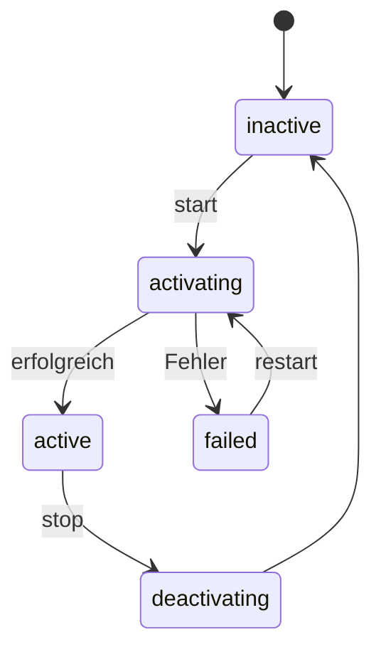
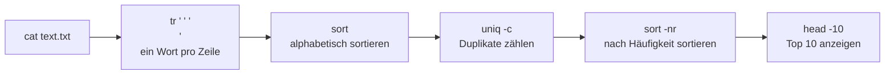

<a id="top"></a>

<div align="center">

# 🐧 Linux Command Cheat Sheet

**Eine umfassende Referenz für Terminal-Befehle — mit Beispielen, Erklärungen und Deep-Dives**


</div>

> **💡 So benutzt du dieses Cheat Sheet:**
> Jede Tabelle zeigt die wichtigsten Befehle auf einen Blick. Unter `📚 Mehr Beispiele & Erklärungen` (aufklappbar) findest du vertiefte Beispiele mit Beispiel-Ausgaben. Ganz unten gibt es Bonus-Referenzen (chmod-Rechner, Kill-Signale, One-Liner, Troubleshooting) sowie eine interaktive Lern-Checkliste.

---

## 📑 Inhaltsverzeichnis

**Grundlagen**
- [01 · 🧭 Navigation & Dateisystem](#navigation)
- [02 · 📁 Dateien & Verzeichnisse verwalten](#dateien)
- [03 · 📝 Dateiinhalte anzeigen & bearbeiten](#inhalte)
- [04 · 🔐 Berechtigungen & Eigentümer](#berechtigungen)

**System & Prozesse**
- [05 · ⚙️ Prozesse & Systemüberwachung](#prozesse)
- [06 · 📦 Paketverwaltung](#pakete)
- [07 · 🖥️ Systeminformationen](#systeminfo)
- [08 · 🛠️ Systemd & Dienste](#systemd)
- [09 · ⏰ Cron & geplante Aufgaben](#cron)

**Netzwerk & Daten**
- [10 · 🌐 Netzwerk & Fernzugriff](#netzwerk)
- [11 · 🗜️ Archivierung & Komprimierung](#archive)
- [12 · 🔍 Textverarbeitung & Suche](#text)
- [13 · 💾 Festplatten & Speicherverwaltung](#speicher)

**Shell & Umgebung**
- [14 · 👤 Benutzer- & Gruppenverwaltung](#benutzer)
- [15 · 🌱 Umgebungsvariablen & Shell](#umgebung)
- [16 · 🔀 Ein-/Ausgabe-Umleitung & Pipes](#umleitung)
- [17 · ⌨️ Wichtige Tastenkürzel](#shortcuts)

**Bonus-Referenzen**
- [18 · 🔢 chmod-Referenz (Oktal-Rechner)](#chmod-referenz)
- [19 · 🚦 Kill-Signale](#signale)
- [20 · 💡 Nützliche One-Liner](#oneliner)
- [21 · 🧯 Troubleshooting-Spickzettel](#troubleshooting)
- [22 · ✅ Interaktive Lern-Checkliste](#checkliste)
- [23 · ❓ FAQ](#faq)

---

<a id="navigation"></a>

## 01 · 🧭 Navigation & Dateisystem

Sich im Dateisystem bewegen und Verzeichnisinhalte anzeigen.

| Befehl | Beschreibung | Beispiel |
|---|---|---|
| `pwd` | Aktuelles Arbeitsverzeichnis anzeigen | `pwd` |
| `ls` | Verzeichnisinhalt auflisten | `ls -la` |
| `cd` | Verzeichnis wechseln | `cd /var/log` |
| `cd ..` | Eine Ebene nach oben wechseln | `cd ..` |
| `cd ~` | Ins Home-Verzeichnis wechseln | `cd ~` |
| `cd -` | Zum vorherigen Verzeichnis zurückspringen | `cd -` |
| `tree` | Verzeichnisbaum grafisch anzeigen | `tree -L 2` |
| `find` | Dateien/Verzeichnisse durchsuchen | `find / -name "*.log"` |
| `locate` | Schnelle Dateisuche über Datenbank | `locate nginx.conf` |
| `which` | Pfad eines Befehls anzeigen | `which python3` |
| `whereis` | Binary, Quellcode & Manpage finden | `whereis bash` |
| `realpath` | Absoluten Pfad einer Datei anzeigen | `realpath ./skript.sh` |
| `pushd` / `popd` | Verzeichnis auf Stack legen / zurückspringen | `pushd /tmp` |

<details>
<summary>📚 Mehr Beispiele & Erklärungen zu Navigation</summary>

**`ls` — Die wichtigsten Flags**

```bash
ls -l     # Lange Ausgabe mit Rechten, Größe, Datum
ls -a     # Zeigt auch versteckte Dateien (beginnend mit .)
ls -la    # Kombination aus beidem
ls -lh    # Größen menschenlesbar (KB/MB/GB statt Bytes)
ls -lt    # Nach Änderungsdatum sortiert (neueste zuerst)
ls -lS    # Nach Dateigröße sortiert (größte zuerst)
```

Beispiel-Ausgabe von `ls -lh`:

```
drwxr-xr-x  3 jan jan 4,0K Jul 20 09:12 projekt
-rw-r--r--  1 jan jan  128 Jul 19 22:04 notizen.txt
-rwxr-xr-x  1 jan jan 2,1K Jul 18 14:33 backup.sh
```

**`find` — Gezielt suchen**

```bash
find . -name "*.js"                 # Alle .js-Dateien im aktuellen Verzeichnis (rekursiv)
find /home -user jan                # Alle Dateien, die "jan" gehören
find . -mtime -7                    # Dateien, die in den letzten 7 Tagen geändert wurden
find . -size +100M                  # Dateien größer als 100 MB
find . -type d -empty               # Leere Verzeichnisse finden
find . -name "*.tmp" -delete        # Gefundene Dateien direkt löschen (Vorsicht!)
```

> **⚠️ Achtung:** `-delete` löscht sofort und unwiderruflich. Erst ohne `-delete` testen, ob die Trefferliste stimmt.

</details>

[⬆️ Nach oben](#top)

---

<a id="dateien"></a>

## 02 · 📁 Dateien & Verzeichnisse verwalten

Erstellen, kopieren, verschieben und löschen von Dateien und Ordnern.

| Befehl | Beschreibung | Beispiel |
|---|---|---|
| `mkdir` | Neues Verzeichnis erstellen | `mkdir -p projekt/src` |
| `rmdir` | Leeres Verzeichnis löschen | `rmdir alter_ordner` |
| `touch` | Leere Datei erstellen / Zeitstempel setzen | `touch datei.txt` |
| `cp` | Dateien/Verzeichnisse kopieren | `cp -r quelle/ ziel/` |
| `mv` | Verschieben oder Umbenennen | `mv alt.txt neu.txt` |
| `rm` | Datei löschen | `rm datei.txt` |
| `rm -rf` | Verzeichnis inkl. Inhalt löschen (Vorsicht!) | `rm -rf ordner/` |
| `ln -s` | Symbolischen Link erstellen | `ln -s /pfad/ziel link` |
| `ln` | Harten Link erstellen | `ln original.txt hard.txt` |
| `stat` | Detaillierte Dateiinformationen anzeigen | `stat datei.txt` |
| `file` | Dateityp bestimmen | `file bild.png` |
| `mktemp` | Temporäre Datei/Verzeichnis erzeugen | `mktemp -d` |

<details>
<summary>📚 Mehr Beispiele & Erklärungen zu Datei-Operationen</summary>

**Symbolischer Link vs. harter Link**

```bash
ln -s /pfad/original.txt link.txt   # Symlink: Verweis auf den Pfad (kann distinkte Dateisysteme queren)
ln /pfad/original.txt hard.txt      # Hardlink: zeigt auf denselben Inode (nur im selben Dateisystem)
```

Ein Symlink ist wie eine Verknüpfung (bricht, wenn das Ziel gelöscht wird), ein Hardlink ist ein zweiter Name für dieselben Daten auf der Festplatte.

**Sicher löschen**

```bash
rm -i datei.txt          # Fragt vor jedem Löschvorgang nach
alias rm='rm -i'         # Praktisch: rm standardmäßig interaktiv machen (in ~/.bashrc)
```

**`cp` mit Fortschritt & Backup**

```bash
cp -v quelle.txt ziel.txt        # -v = verbose, zeigt was kopiert wird
cp -u quelle.txt ziel.txt        # -u = nur kopieren wenn neuer/fehlend (update)
cp --backup=numbered a.txt b.txt # Erstellt nummerierte Backups statt Überschreiben
```

</details>

[⬆️ Nach oben](#top)

---

<a id="inhalte"></a>

## 03 · 📝 Dateiinhalte anzeigen & bearbeiten

Textdateien lesen, durchblättern und im Terminal bearbeiten.

| Befehl | Beschreibung | Beispiel |
|---|---|---|
| `cat` | Dateiinhalt vollständig ausgeben | `cat datei.txt` |
| `cat -n` | Ausgabe mit Zeilennummern | `cat -n skript.sh` |
| `less` | Datei seitenweise durchblättern | `less datei.log` |
| `head` | Erste Zeilen einer Datei anzeigen | `head -n 20 datei.log` |
| `tail` | Letzte Zeilen einer Datei anzeigen | `tail -n 20 datei.log` |
| `tail -f` | Datei live mitverfolgen | `tail -f /var/log/syslog` |
| `nano` | Einfacher Terminal-Editor | `nano datei.txt` |
| `vim` | Fortgeschrittener Terminal-Editor | `vim datei.txt` |
| `diff` | Zwei Dateien vergleichen | `diff a.txt b.txt` |
| `diff -u` | Vergleich im Patch-Format | `diff -u alt.txt neu.txt` |
| `wc` | Zeilen, Wörter, Zeichen zählen | `wc -l datei.txt` |
| `comm` | Zeilenweise Mengen-Vergleich sortierter Dateien | `comm a.txt b.txt` |

<details>
<summary>📚 Mehr Beispiele & Erklärungen zu Dateiinhalten</summary>

**`less` — die wichtigsten Tasten**

| Taste | Wirkung |
|---|---|
| `Leertaste` | Eine Seite vorwärts |
| `b` | Eine Seite zurück |
| `/wort` | Vorwärts nach "wort" suchen |
| `n` | Zum nächsten Suchtreffer springen |
| `g` / `G` | Zum Anfang / Ende der Datei |
| `q` | `less` beenden |

**Mehrere Logs gleichzeitig live verfolgen**

```bash
tail -f /var/log/nginx/access.log /var/log/nginx/error.log
```

**`diff -u` Ausgabe verstehen** (Patch-Format, `-` = entfernt, `+` = hinzugefügt):

```diff
--- alt.txt
+++ neu.txt
@@ -1,3 +1,3 @@
 Zeile eins
-Zeile zwei (alt)
+Zeile zwei (neu)
 Zeile drei
```

</details>

[⬆️ Nach oben](#top)

---

<a id="berechtigungen"></a>

## 04 · 🔐 Berechtigungen & Eigentümer

Zugriffsrechte und Besitzverhältnisse von Dateien steuern.

| Befehl | Beschreibung | Beispiel |
|---|---|---|
| `chmod` | Zugriffsrechte ändern (numerisch) | `chmod 755 skript.sh` |
| `chmod +x` | Datei ausführbar machen (symbolisch) | `chmod +x skript.sh` |
| `chmod -R` | Rechte rekursiv für ganzen Ordner ändern | `chmod -R 644 ordner/` |
| `chown` | Eigentümer ändern | `chown user:gruppe datei.txt` |
| `chown -R` | Eigentümer rekursiv ändern | `chown -R www-data:www-data /var/www` |
| `chgrp` | Gruppe ändern | `chgrp entwickler datei.txt` |
| `umask` | Standard-Rechtemaske anzeigen/setzen | `umask 022` |
| `getfacl` | Erweiterte ACL-Rechte anzeigen | `getfacl datei.txt` |
| `setfacl` | Erweiterte ACL-Rechte setzen | `setfacl -m u:jan:rwx datei` |

<details>
<summary>📚 Mehr Beispiele & Erklärungen zu Berechtigungen</summary>

**Numerisch vs. symbolisch**

```bash
chmod 644 datei.txt      # Owner: rw-, Gruppe: r--, Andere: r--
chmod u+x skript.sh      # Nur dem Owner Ausführrecht hinzufügen
chmod g-w datei.txt      # Der Gruppe das Schreibrecht entziehen
chmod o=r datei.txt      # "Andere" exakt auf Leserecht setzen
chmod a+r datei.txt      # Allen (owner, group, others) Leserecht geben
```

Eine vollständige Oktal-Referenz-Tabelle findest du unter [18 · chmod-Referenz](#chmod-referenz).

**Typischer Fehler: "Permission denied" bei Skript-Ausführung**

```bash
./skript.sh
# bash: ./skript.sh: Permission denied
chmod +x skript.sh   # Ausführrecht setzen
./skript.sh          # jetzt funktioniert es
```

</details>

[⬆️ Nach oben](#top)

---

<a id="prozesse"></a>

## 05 · ⚙️ Prozesse & Systemüberwachung

Laufende Prozesse überwachen, priorisieren und beenden.

| Befehl | Beschreibung | Beispiel |
|---|---|---|
| `ps aux` | Laufende Prozesse anzeigen (BSD-Stil) | `ps aux` |
| `ps -ef` | Laufende Prozesse anzeigen (UNIX-Stil) | `ps -ef` |
| `top` | Prozesse live überwachen | `top` |
| `htop` | Interaktive Prozessübersicht (erweitert) | `htop` |
| `kill` | Prozess anhand PID beenden | `kill 1234` |
| `kill -9` | Prozess erzwungen beenden | `kill -9 1234` |
| `kill -l` | Alle verfügbaren Signale auflisten | `kill -l` |
| `killall` | Prozesse anhand Namen beenden | `killall firefox` |
| `pkill` | Prozesse per Muster beenden | `pkill -f node` |
| `jobs` | Hintergrundjobs der Shell anzeigen | `jobs` |
| `bg` / `fg` | Job in Hinter-/Vordergrund setzen | `fg %1` |
| `nice` | Prozess mit Priorität starten | `nice -n 10 skript.sh` |
| `renice` | Priorität laufender Prozesse ändern | `renice 5 -p 1234` |
| `nohup` | Prozess von Terminal entkoppeln | `nohup ./server.sh &` |
| `disown` | Job aus Job-Tabelle der Shell entfernen | `disown %1` |

<details>
<summary>📚 Mehr Beispiele & Erklärungen zu Prozessen</summary>

**Prozess nach Namen finden und beenden**

```bash
ps aux | grep node          # Alle Node-Prozesse auflisten
pkill -f "node server.js"   # Prozess anhand Kommandozeile beenden
```

**Vordergrund/Hintergrund-Workflow**

```bash
./langer_task.sh        # Läuft im Vordergrund
# Strg+Z drücken -> Prozess wird angehalten
bg                      # Im Hintergrund weiterlaufen lassen
jobs                    # Zeigt: [1]+ Running  ./langer_task.sh &
fg %1                   # Zurück in den Vordergrund holen
```

**Prozess dauerhaft im Hintergrund laufen lassen (übersteht Terminal-Schließen)**

```bash
nohup ./server.sh > log.txt 2>&1 &
disown
```

</details>

[⬆️ Nach oben](#top)

---

<a id="pakete"></a>

## 06 · 📦 Paketverwaltung

Software installieren, aktualisieren und entfernen (distributionsabhängig).

| Befehl | Beschreibung | Beispiel |
|---|---|---|
| `apt update && apt upgrade` | Debian/Ubuntu: Paketlisten & System aktualisieren | `sudo apt update && sudo apt upgrade` |
| `apt install` | Debian/Ubuntu: Paket installieren | `sudo apt install git` |
| `apt remove` | Debian/Ubuntu: Paket entfernen | `sudo apt remove git` |
| `apt search` | Debian/Ubuntu: Paket suchen | `apt search nginx` |
| `dpkg -i` | Debian: `.deb`-Paket manuell installieren | `sudo dpkg -i paket.deb` |
| `dnf` / `yum` | Fedora/RHEL: Paket installieren | `sudo dnf install git` |
| `pacman -S` | Arch Linux: Paket installieren | `sudo pacman -S git` |
| `pacman -Syu` | Arch Linux: Gesamtes System aktualisieren | `sudo pacman -Syu` |
| `snap install` | Universelles Snap-Paket installieren | `sudo snap install code` |
| `flatpak install` | Universelles Flatpak-Paket installieren | `flatpak install flathub org.gimp.GIMP` |

<details>
<summary>📚 Mehr Beispiele & Erklärungen zur Paketverwaltung</summary>

**System aufräumen (nicht mehr benötigte Pakete entfernen)**

```bash
sudo apt autoremove && sudo apt clean     # Debian/Ubuntu
sudo dnf autoremove && sudo dnf clean all # Fedora/RHEL
sudo pacman -Sc                           # Arch Linux
```

**Installierte Pakete auflisten**

```bash
dpkg -l | less        # Debian/Ubuntu
dnf list installed     # Fedora/RHEL
pacman -Q              # Arch Linux
```

</details>

[⬆️ Nach oben](#top)

---

<a id="systeminfo"></a>

## 07 · 🖥️ Systeminformationen

Hardware, Auslastung und Systemzustand einsehen.

| Befehl | Beschreibung | Beispiel |
|---|---|---|
| `uname -a` | Kernel- & Systeminformationen anzeigen | `uname -a` |
| `cat /etc/os-release` | Distribution & Version anzeigen | `cat /etc/os-release` |
| `uptime` | Systemlaufzeit & Auslastung anzeigen | `uptime` |
| `free -h` | Arbeitsspeicher-Nutzung anzeigen | `free -h` |
| `lscpu` | CPU-Informationen anzeigen | `lscpu` |
| `nproc` | Anzahl verfügbarer CPU-Kerne | `nproc` |
| `lsusb` | USB-Geräte auflisten | `lsusb` |
| `lspci` | PCI-Geräte auflisten | `lspci` |
| `hostnamectl` | Hostname & OS-Details anzeigen | `hostnamectl` |
| `dmesg` | Kernel-Ringpuffer / Hardware-Meldungen | `dmesg \| tail -20` |
| `vmstat` | Systemauslastung (CPU, Speicher, I/O) | `vmstat 2 5` |

<details>
<summary>📚 Mehr Beispiele & Erklärungen zu Systeminformationen</summary>

**`free -h` Ausgabe verstehen**

```
              total        used        free      shared  buff/cache   available
Mem:           15Gi       4,2Gi       6,1Gi       412Mi       5,0Gi        10Gi
Swap:         2,0Gi          0B       2,0Gi
```

`available` ist die realistische Zahl — sie berücksichtigt, dass der Cache bei Bedarf freigegeben werden kann.

**Letzte Hardware-/Kernel-Fehler ansehen**

```bash
dmesg | tail -30
dmesg | grep -i error
```

</details>

[⬆️ Nach oben](#top)

---

<a id="systemd"></a>

## 08 · 🛠️ Systemd & Dienste

Hintergrunddienste (Services) verwalten und Logs einsehen.

| Befehl | Beschreibung | Beispiel |
|---|---|---|
| `systemctl status` | Status eines Diensts anzeigen | `systemctl status nginx` |
| `systemctl start` / `stop` | Dienst starten/stoppen | `sudo systemctl start nginx` |
| `systemctl restart` | Dienst neu starten | `sudo systemctl restart nginx` |
| `systemctl reload` | Konfiguration neu laden (ohne Neustart) | `sudo systemctl reload nginx` |
| `systemctl enable` / `disable` | Dienst beim Boot (de)aktivieren | `sudo systemctl enable nginx` |
| `systemctl is-enabled` | Prüfen ob Autostart aktiv ist | `systemctl is-enabled nginx` |
| `systemctl list-units` | Alle aktiven Units auflisten | `systemctl list-units --type=service` |
| `journalctl -u` | Logs eines bestimmten Diensts | `journalctl -u nginx` |
| `journalctl -f` | Logs live mitverfolgen | `journalctl -f` |
| `journalctl --since` | Logs ab Zeitpunkt anzeigen | `journalctl --since "1 hour ago"` |

<details>
<summary>📚 Mehr Beispiele & Erklärungen zu Systemd</summary>

**Lebenszyklus eines Diensts**



**Warum startet mein Dienst nicht?**

```bash
systemctl status meinservice.service   # Kurzer Überblick + letzte Zeilen
journalctl -u meinservice.service -xe  # Ausführliche Fehlerdetails
```

</details>

[⬆️ Nach oben](#top)

---

<a id="cron"></a>

## 09 · ⏰ Cron & geplante Aufgaben

Befehle automatisiert zu festen Zeiten ausführen.

| Befehl | Beschreibung | Beispiel |
|---|---|---|
| `crontab -e` | Cronjobs bearbeiten | `crontab -e` |
| `crontab -l` | Aktuelle Cronjobs anzeigen | `crontab -l` |
| `crontab -r` | Alle Cronjobs des Nutzers löschen | `crontab -r` |
| `at` | Einmaligen Befehl zu späterem Zeitpunkt ausführen | `at 22:00 -f skript.sh` |

<details>
<summary>📚 Mehr Beispiele & Erklärungen zu Cron</summary>

**Die 5 Zeitfelder von Cron**

```
┌───────────── Minute        (0 - 59)
│ ┌───────────── Stunde      (0 - 23)
│ │ ┌───────────── Tag im Monat (1 - 31)
│ │ │ ┌───────────── Monat   (1 - 12)
│ │ │ │ ┌───────────── Wochentag (0 - 6, So=0)
│ │ │ │ │
* * * * *  Befehl
```

**Beispiel-Zeitpläne**

| Ausdruck | Bedeutung |
|---|---|
| `*/5 * * * *` | Alle 5 Minuten |
| `0 3 * * *` | Täglich um 3:00 Uhr |
| `0 0 * * 0` | Jeden Sonntag um Mitternacht |
| `0 9-17 * * 1-5` | Stündlich zwischen 9–17 Uhr, Mo–Fr |
| `0 0 1 * *` | Am 1. jedes Monats um Mitternacht |

```bash
# Beispiel-Eintrag: tägliches Backup um 3 Uhr nachts
0 3 * * * /home/jan/backup.sh >> /home/jan/backup.log 2>&1
```

</details>

[⬆️ Nach oben](#top)

---

<a id="netzwerk"></a>

## 10 · 🌐 Netzwerk & Fernzugriff

Verbindungen prüfen, Daten übertragen und Netzwerkkonfiguration einsehen.

| Befehl | Beschreibung | Beispiel |
|---|---|---|
| `ip a` | Netzwerkschnittstellen & IP-Adressen anzeigen | `ip a` |
| `ip route` | Routing-Tabelle anzeigen | `ip route` |
| `ifconfig` | Netzwerkschnittstellen anzeigen (älter) | `ifconfig` |
| `ping` | Erreichbarkeit eines Hosts testen | `ping example.com` |
| `curl` | HTTP-Anfragen senden / Dateien laden | `curl -O https://example.com/file` |
| `wget` | Dateien aus dem Web herunterladen | `wget https://example.com/file.zip` |
| `ss` | Netzwerkverbindungen/Ports anzeigen | `ss -tulpn` |
| `netstat` | Netzwerkverbindungen anzeigen (älter) | `netstat -tulpn` |
| `ssh` | Sichere Verbindung zu Remote-Host | `ssh user@server.de` |
| `scp` | Dateien sicher über SSH kopieren | `scp datei.txt user@host:/pfad` |
| `rsync` | Dateien effizient synchronisieren | `rsync -avz src/ user@host:/ziel/` |
| `dig` / `nslookup` | DNS-Auflösung prüfen | `dig example.com` |
| `traceroute` | Netzwerkpfad zu einem Host anzeigen | `traceroute example.com` |
| `nc` (netcat) | Rohe TCP/UDP-Verbindungen testen | `nc -zv example.com 443` |

<details>
<summary>📚 Mehr Beispiele & Erklärungen zu Netzwerk</summary>

**`curl` — häufige Anwendungsfälle**

```bash
curl -I https://example.com                  # Nur HTTP-Header anzeigen
curl -O https://example.com/datei.zip         # Datei mit Originalnamen speichern
curl -X POST -H "Content-Type: application/json" \
     -d '{"name":"Jan"}' https://api.example.com/users
```

**SSH-Portweiterleitung (lokal → remote)**

```bash
ssh -L 8080:localhost:80 user@server.de
# Öffnet lokal Port 8080, der zu Port 80 auf dem Server durchgereicht wird
```

**SSH-Konfiguration für häufige Hosts (`~/.ssh/config`)**

```
Host meinserver
    HostName 192.168.1.100
    User jan
    Port 22
    IdentityFile ~/.ssh/id_ed25519
```

Danach reicht: `ssh meinserver`

</details>

[⬆️ Nach oben](#top)

---

<a id="archive"></a>

## 11 · 🗜️ Archivierung & Komprimierung

Dateien bündeln, komprimieren und wieder entpacken.

| Befehl | Beschreibung | Beispiel |
|---|---|---|
| `tar -cvf` | Tar-Archiv erstellen | `tar -cvf archiv.tar ordner/` |
| `tar -xvf` | Tar-Archiv entpacken | `tar -xvf archiv.tar` |
| `tar -czvf` | Gzip-komprimiertes Archiv erstellen | `tar -czvf archiv.tar.gz ordner/` |
| `tar -xzvf` | Gzip-komprimiertes Archiv entpacken | `tar -xzvf archiv.tar.gz` |
| `tar -tvf` | Archivinhalt auflisten (ohne Entpacken) | `tar -tvf archiv.tar.gz` |
| `zip` | ZIP-Archiv erstellen | `zip -r archiv.zip ordner/` |
| `unzip` | ZIP-Archiv entpacken | `unzip archiv.zip` |
| `gzip` / `gunzip` | Einzelne Datei komprimieren/entpacken | `gzip datei.txt` |
| `xz` | Starke Komprimierung einzelner Dateien | `xz datei.txt` |

<details>
<summary>📚 Mehr Beispiele & Erklärungen zu Archiven</summary>

**Einzelne Datei aus einem Archiv extrahieren**

```bash
tar -xzvf archiv.tar.gz pfad/im/archiv/datei.txt
```

**Merkhilfe für `tar`-Flags:** `c`=create, `x`=extract, `t`=list, `v`=verbose, `z`=gzip, `f`=file (muss immer zuletzt vor dem Dateinamen stehen).

</details>

[⬆️ Nach oben](#top)

---

<a id="text"></a>

## 12 · 🔍 Textverarbeitung & Suche

Textdaten filtern, durchsuchen und transformieren.

| Befehl | Beschreibung | Beispiel |
|---|---|---|
| `grep` | Textmuster in Dateien suchen | `grep -r "fehler" /var/log` |
| `grep -i` | Groß-/Kleinschreibung ignorieren | `grep -i "error" log.txt` |
| `grep -v` | Zeilen ausschließen, die matchen | `grep -v "debug" log.txt` |
| `grep -c` | Anzahl der Treffer zählen | `grep -c "404" access.log` |
| `sed` | Text suchen und ersetzen (Stream-Editor) | `sed 's/alt/neu/g' datei.txt` |
| `sed -i` | Datei direkt bearbeiten (in place) | `sed -i 's/alt/neu/g' datei.txt` |
| `awk` | Spaltenbasierte Textverarbeitung | `awk '{print $1}' datei.txt` |
| `sort` | Zeilen sortieren | `sort -n zahlen.txt` |
| `uniq -c` | Doppelte Zeilen zählen | `sort datei.txt \| uniq -c` |
| `cut` | Spalten aus Zeilen extrahieren | `cut -d',' -f2 daten.csv` |
| `tr` | Zeichen ersetzen/löschen | `tr 'a-z' 'A-Z' < datei.txt` |
| `xargs` | Ausgabe als Argumente an Befehl übergeben | `find . -name "*.tmp" \| xargs rm` |

<details>
<summary>📚 Mehr Beispiele & Erklärungen zu Textverarbeitung</summary>

**Wörter zählen und nach Häufigkeit sortieren (klassisches Pipe-Beispiel)**

```bash
cat text.txt | tr ' ' '\n' | sort | uniq -c | sort -nr | head -10
```

So funktioniert die Pipe-Kette:



**`sed` — Suchen & Ersetzen**

```bash
sed 's/Hund/Katze/' datei.txt        # Ersetzt nur das erste Vorkommen je Zeile
sed 's/Hund/Katze/g' datei.txt       # Ersetzt alle Vorkommen (global)
sed -i.bak 's/alt/neu/g' datei.txt   # Ändert die Datei direkt, legt Backup .bak an
```

**`awk` — Spalten verarbeiten**

```bash
awk '{print $1, $3}' daten.txt         # Spalte 1 und 3 ausgeben
awk -F',' '{print $2}' daten.csv       # Trennzeichen Komma verwenden
awk '{sum += $2} END {print sum}' zahlen.txt   # Spalte 2 aufsummieren
```

</details>

[⬆️ Nach oben](#top)

---

<a id="speicher"></a>

## 13 · 💾 Festplatten & Speicherverwaltung

Speicherplatz, Laufwerke und Dateisysteme verwalten.

| Befehl | Beschreibung | Beispiel |
|---|---|---|
| `df -h` | Speicherplatz aller Dateisysteme anzeigen | `df -h` |
| `df -i` | Belegte/freie Inodes anzeigen | `df -i` |
| `du -sh` | Speicherbelegung eines Ordners anzeigen | `du -sh /var/log` |
| `mount` | Dateisystem einhängen | `mount /dev/sdb1 /mnt/usb` |
| `umount` | Dateisystem aushängen | `umount /mnt/usb` |
| `lsblk` | Blockgeräte/Partitionen auflisten | `lsblk` |
| `fdisk -l` | Partitionstabellen anzeigen | `sudo fdisk -l` |
| `mkfs` | Dateisystem auf Partition erstellen | `mkfs.ext4 /dev/sdb1` |
| `blkid` | UUIDs & Dateisystemtypen anzeigen | `blkid` |
| `fsck` | Dateisystem auf Fehler prüfen | `sudo fsck /dev/sdb1` |

<details>
<summary>📚 Mehr Beispiele & Erklärungen zu Speicher</summary>

**Die 10 größten Ordner im aktuellen Verzeichnis finden**

```bash
du -sh */ 2>/dev/null | sort -rh | head -10
```

**Warum ist meine Platte voll, obwohl `du` wenig anzeigt?**
Meist liegt es an gelöschten, aber noch geöffneten Dateien (z. B. von einem Log-Prozess). Prüfen mit:

```bash
lsof +L1
```

</details>

[⬆️ Nach oben](#top)

---

<a id="benutzer"></a>

## 14 · 👤 Benutzer- & Gruppenverwaltung

Benutzerkonten, Gruppen und Berechtigungen auf Systemebene verwalten.

| Befehl | Beschreibung | Beispiel |
|---|---|---|
| `whoami` | Aktuellen Benutzer anzeigen | `whoami` |
| `id` | Benutzer- und Gruppen-IDs anzeigen | `id` |
| `useradd -m` | Neuen Benutzer mit Home-Verzeichnis anlegen | `sudo useradd -m jan` |
| `usermod -aG` | Benutzer einer Gruppe hinzufügen | `sudo usermod -aG sudo jan` |
| `passwd` | Passwort ändern | `passwd` |
| `userdel` | Benutzer löschen | `sudo userdel -r jan` |
| `groupadd` | Neue Gruppe anlegen | `sudo groupadd entwickler` |
| `su` | Zu anderem Benutzer wechseln | `su jan` |
| `sudo` | Befehl mit Root-Rechten ausführen | `sudo apt update` |
| `sudo -l` | Eigene sudo-Rechte anzeigen | `sudo -l` |
| `who` / `w` | Angemeldete Benutzer anzeigen | `who` |
| `last` | Letzte Logins anzeigen | `last -5` |

<details>
<summary>📚 Mehr Beispiele & Erklärungen zu Benutzerverwaltung</summary>

**Benutzer zu einer Gruppe hinzufügen (z. B. Docker-Nutzung ohne sudo)**

```bash
sudo usermod -aG docker jan
# Danach: ab- und wieder anmelden, damit die Gruppenmitgliedschaft aktiv wird
```

**`su` vs. `sudo` — kurz erklärt:** `su` wechselt komplett zu einem anderen Benutzer (meist root) und startet dessen Shell. `sudo` führt nur *einen einzelnen Befehl* mit erhöhten Rechten aus und kehrt danach zum eigenen Benutzer zurück — das ist der sicherere, empfohlene Weg.

</details>

[⬆️ Nach oben](#top)

---

<a id="umgebung"></a>

## 15 · 🌱 Umgebungsvariablen & Shell

Shell-Umgebung konfigurieren und Verlauf nutzen.

| Befehl | Beschreibung | Beispiel |
|---|---|---|
| `export` | Umgebungsvariable setzen | `export PATH=$PATH:/neu/pfad` |
| `echo $VAR` | Wert einer Variable anzeigen | `echo $HOME` |
| `env` / `printenv` | Alle Umgebungsvariablen anzeigen | `env` |
| `alias` | Kurzbefehl definieren | `alias ll='ls -la'` |
| `unalias` | Alias entfernen | `unalias ll` |
| `history` | Befehlsverlauf anzeigen | `history` |
| `source` | Skript in aktueller Shell ausführen | `source ~/.bashrc` |
| `set` / `unset` | Shell-Variable setzen/entfernen | `unset MEINE_VAR` |

<details>
<summary>📚 Mehr Beispiele & Erklärungen zu Umgebungsvariablen</summary>

**Die wichtigsten vordefinierten Variablen**

| Variable | Bedeutung |
|---|---|
| `$HOME` | Home-Verzeichnis des Benutzers |
| `$USER` | Aktueller Benutzername |
| `$PATH` | Suchpfade für ausführbare Programme |
| `$SHELL` | Aktuell verwendete Shell |
| `$PWD` | Aktuelles Arbeitsverzeichnis |
| `$EDITOR` | Standard-Texteditor für Terminal-Programme |

**Alias & PATH dauerhaft speichern**

```bash
echo "alias ll='ls -la'" >> ~/.bashrc
echo 'export PATH=$PATH:$HOME/bin' >> ~/.bashrc
source ~/.bashrc   # Änderungen sofort anwenden, ohne neu einzuloggen
```

</details>

[⬆️ Nach oben](#top)

---

<a id="umleitung"></a>

## 16 · 🔀 Ein-/Ausgabe-Umleitung & Pipes

Ausgaben umleiten und Befehle miteinander verketten.

| Operator | Beschreibung | Beispiel |
|---|---|---|
| `>` | Ausgabe in Datei schreiben (überschreiben) | `echo "hi" > datei.txt` |
| `>>` | Ausgabe an Datei anhängen | `echo "hi" >> datei.txt` |
| `<` | Datei als Eingabe verwenden | `sort < daten.txt` |
| `\|` | Ausgabe an nächsten Befehl weiterleiten | `ps aux \| grep nginx` |
| `&&` | Nächsten Befehl nur bei Erfolg ausführen | `mkdir neu && cd neu` |
| `\|\|` | Nächsten Befehl nur bei Fehler ausführen | `test -f a \|\| echo fehlt` |
| `;` | Befehle nacheinander ausführen (unabhängig) | `echo a; echo b` |
| `&` | Befehl im Hintergrund starten | `./skript.sh &` |
| `2>` | Nur Fehlerausgabe umleiten | `befehl 2> fehler.log` |
| `2>&1` | Fehlerausgabe mit Standardausgabe zusammenführen | `befehl > alles.log 2>&1` |
| `/dev/null` | "Datenmülleimer" — Ausgabe verwerfen | `befehl > /dev/null 2>&1` |

<details>
<summary>📚 Mehr Beispiele & Erklärungen zu Umleitung & Pipes</summary>

**stdout und stderr getrennt behandeln**

```bash
befehl 1> ausgabe.log 2> fehler.log   # Erfolg und Fehler in getrennte Dateien
befehl > alles.log 2>&1               # Beides zusammen in eine Datei
```

**`tee` — Ausgabe gleichzeitig anzeigen UND speichern**

```bash
befehl | tee protokoll.log
# Zeigt die Ausgabe im Terminal UND schreibt sie in protokoll.log
```

</details>

[⬆️ Nach oben](#top)

---

<a id="shortcuts"></a>

## 17 · ⌨️ Wichtige Tastenkürzel

Nützliche Shell-Shortcuts für den täglichen Gebrauch.

| Tastenkombination | Wirkung |
|---|---|
| `Strg + C` | Laufenden Befehl abbrechen |
| `Strg + Z` | Prozess anhalten (in Hintergrund pausieren) |
| `Strg + D` | Aktuelle Shell-Sitzung beenden (EOF) |
| `Strg + R` | Rückwärtssuche im Befehlsverlauf |
| `Strg + L` | Terminal-Bildschirm leeren (wie `clear`) |
| `Strg + A` / `Strg + E` | Zum Zeilenanfang / Zeilenende springen |
| `Strg + U` | Zeile bis zum Cursor löschen |
| `Strg + K` | Zeile ab Cursor bis Ende löschen |
| `Strg + W` | Letztes Wort vor dem Cursor löschen |
| `Tab` | Autovervollständigung |
| `!!` | Letzten Befehl wiederholen |
| `!$` | Letztes Argument des vorigen Befehls einfügen |

[⬆️ Nach oben](#top)

---

<a id="chmod-referenz"></a>

## 18 · 🔢 chmod-Referenz (Oktal-Rechner)

Jede Rechteklasse (Owner/Gruppe/Andere) wird aus drei Bits gebildet: **r**ead (4), **w**rite (2), e**x**ecute (1) — addiert ergibt die Ziffer.

| Ziffer | Rechte | Symbolisch |
|---|---|---|
| 0 | Keine Rechte | `---` |
| 1 | Nur Ausführen | `--x` |
| 2 | Nur Schreiben | `-w-` |
| 3 | Schreiben + Ausführen | `-wx` |
| 4 | Nur Lesen | `r--` |
| 5 | Lesen + Ausführen | `r-x` |
| 6 | Lesen + Schreiben | `rw-` |
| 7 | Lesen + Schreiben + Ausführen | `rwx` |

**Gängige Kombinationen**

| Befehl | Bedeutung | Typischer Einsatz |
|---|---|---|
| `chmod 644 datei` | Owner: rw-, Gruppe: r--, Andere: r-- | Normale Dateien (z. B. Textdateien) |
| `chmod 755 datei` | Owner: rwx, Gruppe: r-x, Andere: r-x | Ausführbare Skripte, Programme |
| `chmod 700 datei` | Owner: rwx, Gruppe: ---, Andere: --- | Private Dateien/Skripte |
| `chmod 600 datei` | Owner: rw-, Gruppe: ---, Andere: --- | Sensible Dateien (z. B. SSH-Keys) |
| `chmod 777 datei` | Alle: rwx | ⚠️ Fast nie empfohlen — jeder darf alles |

> **💡 Tipp:** `chmod 777` sollte man in der Praxis so gut wie nie verwenden — es öffnet die Datei für jeden Benutzer auf dem System uneingeschränkt. Meist ist `755` (für Programme) oder `644` (für Daten) die richtige Wahl.

[⬆️ Nach oben](#top)

---

<a id="signale"></a>

## 19 · 🚦 Kill-Signale

Signale, mit denen Prozesse gesteuert oder beendet werden können.

| Signal | Nummer | Bedeutung |
|---|---|---|
| `SIGHUP` | 1 | Terminal geschlossen / Konfiguration neu laden |
| `SIGINT` | 2 | Unterbrechung (entspricht `Strg + C`) |
| `SIGKILL` | 9 | Sofortiger, erzwungener Abbruch (nicht abfangbar) |
| `SIGTERM` | 15 | Höfliche Aufforderung zum Beenden (Standard bei `kill`) |
| `SIGSTOP` | 19 | Prozess anhalten (nicht abfangbar) |
| `SIGCONT` | 18 | Angehaltenen Prozess fortsetzen |

```bash
kill -15 1234    # Höflich bitten, sich zu beenden (Standard)
kill -9 1234     # Sofort erzwingen — nur wenn SIGTERM nicht wirkt
kill -l          # Alle verfügbaren Signale mit Nummern auflisten
```

> **💡 Tipp:** Immer zuerst `SIGTERM` (15) versuchen — das gibt dem Programm die Chance, Dateien sauber zu schließen. Erst wenn das nicht hilft, `SIGKILL` (9) einsetzen.

[⬆️ Nach oben](#top)

---

<a id="oneliner"></a>

## 20 · 💡 Nützliche One-Liner

Praktische Befehlskombinationen für den Alltag.

```bash
# Die 10 größten Dateien im aktuellen Verzeichnis (rekursiv) finden
find . -type f -exec du -h {} + | sort -rh | head -10

# Alle Dateien in Unterordnern zählen
find . -type f | wc -l

# Prozess finden, der einen bestimmten Port belegt
sudo ss -tulpn | grep :8080

# Alle .txt-Dateien in .bak umbenennen (Batch-Umbenennung)
for f in *.txt; do mv "$f" "${f%.txt}.bak"; done

# Öffentliche IP-Adresse des eigenen Rechners herausfinden
curl -s ifconfig.me

# Verzeichnis mit Datum als Backup sichern
rsync -avz projekt/ backup/projekt_$(date +%Y%m%d)/

# Live die CPU-lastigsten Prozesse anzeigen (ohne htop)
ps aux --sort=-%cpu | head -10

# Nach einem String in allen Dateien eines Projekts suchen (Zeilennummer inklusive)
grep -rn "TODO" --include="*.js" .

# Alle abgelaufenen Docker-Container aufräumen
docker system prune -f

# Countdown-Timer direkt im Terminal
sleep 10 && echo "Fertig!"
```

[⬆️ Nach oben](#top)

---

<a id="troubleshooting"></a>

## 21 · 🧯 Troubleshooting-Spickzettel

| Problem | Diagnose-Befehle |
|---|---|
| Festplatte voll | `df -h`, `du -sh */ \| sort -rh` |
| Port bereits belegt | `ss -tulpn \| grep <port>`, `lsof -i :<port>` |
| Prozess reagiert nicht | `ps aux \| grep <name>`, `kill -15` dann ggf. `kill -9` |
| „Permission denied“ | `ls -l datei`, `chmod`/`chown` prüfen |
| Dienst startet nicht | `systemctl status <dienst>`, `journalctl -xe -u <dienst>` |
| DNS funktioniert nicht | `dig example.com`, `cat /etc/resolv.conf` |
| Hohe CPU-/RAM-Last | `top`, `htop`, `ps aux --sort=-%cpu` |
| „Command not found“ | `which <befehl>`, `echo $PATH` prüfen |
| Netzwerk nicht erreichbar | `ip a`, `ping <host>`, `ip route` |

[⬆️ Nach oben](#top)

---

<a id="checkliste"></a>

## 22 · ✅ Interaktive Lern-Checkliste

Hake ab, was du bereits sicher beherrschst — praktisch, um den eigenen Fortschritt im Blick zu behalten (funktioniert direkt in GitHub- und Markdown-Editoren).

- [ ] Navigation & Dateisystem (`cd`, `ls`, `find`)
- [ ] Dateien & Verzeichnisse verwalten (`cp`, `mv`, `rm`, `ln`)
- [ ] Dateiinhalte anzeigen & bearbeiten (`cat`, `less`, `vim`)
- [ ] Berechtigungen & Eigentümer (`chmod`, `chown`)
- [ ] Prozesse & Systemüberwachung (`ps`, `top`, `kill`)
- [ ] Paketverwaltung (`apt`/`dnf`/`pacman`)
- [ ] Systeminformationen (`uname`, `free`, `lscpu`)
- [ ] Systemd & Dienste (`systemctl`, `journalctl`)
- [ ] Cron & geplante Aufgaben (`crontab`)
- [ ] Netzwerk & Fernzugriff (`ssh`, `curl`, `ss`)
- [ ] Archivierung & Komprimierung (`tar`, `zip`)
- [ ] Textverarbeitung & Suche (`grep`, `sed`, `awk`)
- [ ] Festplatten & Speicherverwaltung (`df`, `du`, `lsblk`)
- [ ] Benutzer- & Gruppenverwaltung (`useradd`, `sudo`)
- [ ] Umgebungsvariablen & Shell (`export`, `alias`)
- [ ] Ein-/Ausgabe-Umleitung & Pipes (`>`, `\|`, `&&`)
- [ ] Tastenkürzel im Terminal
- [ ] chmod-Oktal-Notation im Kopf berechnen können

[⬆️ Nach oben](#top)

---

<a id="faq"></a>

## 23 · ❓ FAQ

<details>
<summary><strong>Was ist der Unterschied zwischen <code>sudo</code> und <code>su</code>?</strong></summary>
<br>

`sudo` führt einen einzelnen Befehl mit erhöhten Rechten aus und kehrt danach zu deinem normalen Benutzer zurück. `su` wechselt komplett zu einem anderen Benutzer (meist root) und bleibt dort, bis du `exit` eingibst. `sudo` gilt als sicherer, weil es gezielter ist und alle Aktionen protokolliert.
</details>

<details>
<summary><strong>Warum sollte ich <code>chmod 777</code> vermeiden?</strong></summary>
<br>

`777` gibt jedem Benutzer auf dem System vollen Lese-, Schreib- und Ausführzugriff — auch böswilligen Prozessen oder anderen Nutzern. In den allermeisten Fällen reicht `755` (für ausführbare Dateien) oder `644` (für normale Dateien) völlig aus.
</details>

<details>
<summary><strong>Wie finde ich heraus, welche Shell ich gerade benutze?</strong></summary>
<br>

```bash
echo $SHELL       # Standard-Shell des Benutzers
ps -p $$          # Tatsächlich aktive Shell im aktuellen Prozess
```
</details>

<details>
<summary><strong>Wie beende ich einen hängenden Prozess sicher?</strong></summary>
<br>

Erst `kill -15 <PID>` (SIGTERM) versuchen — das erlaubt dem Programm, sauber aufzuräumen. Reagiert der Prozess nach ein paar Sekunden nicht, mit `kill -9 <PID>` (SIGKILL) erzwingen.
</details>

<details>
<summary><strong>Was bedeutet das <code>$</code> bzw. <code>#</code> am Anfang von Terminal-Beispielen?</strong></summary>
<br>

`$` steht für einen normalen Benutzer-Prompt, `#` für eine Root-Shell. In diesem Cheat Sheet werden diese Zeichen weggelassen — die Befehle selbst beginnen direkt, z. B. mit `ls` oder `sudo apt update`.
</details>

[⬆️ Nach oben](#top)

---

<div align="center">

*Stand: Juli 2026 · Erstellt als persönliches Nachschlagewerk*

</div>
